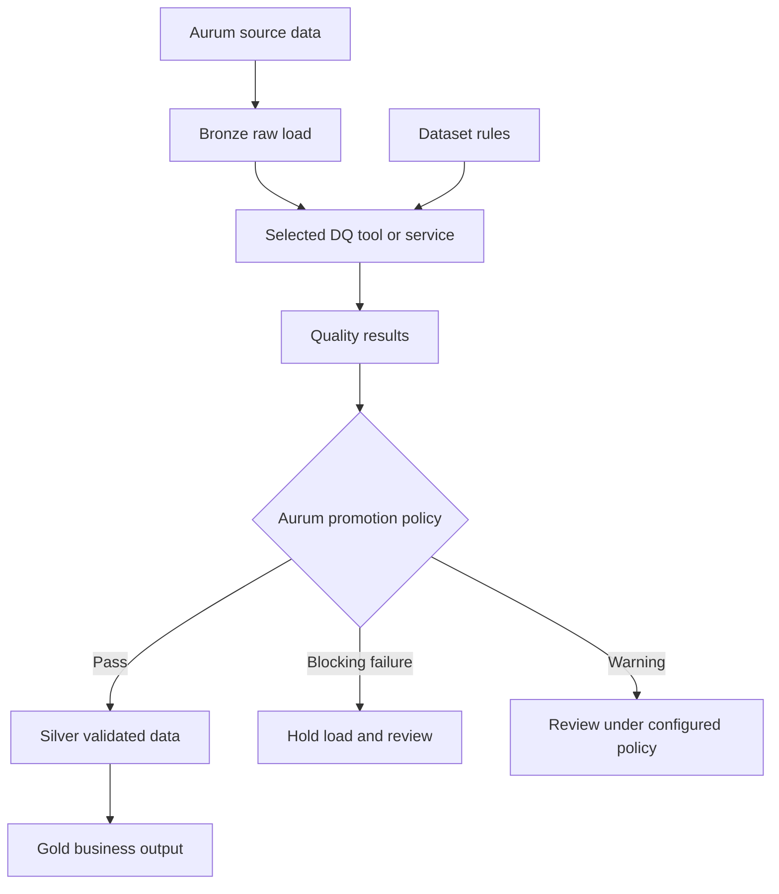
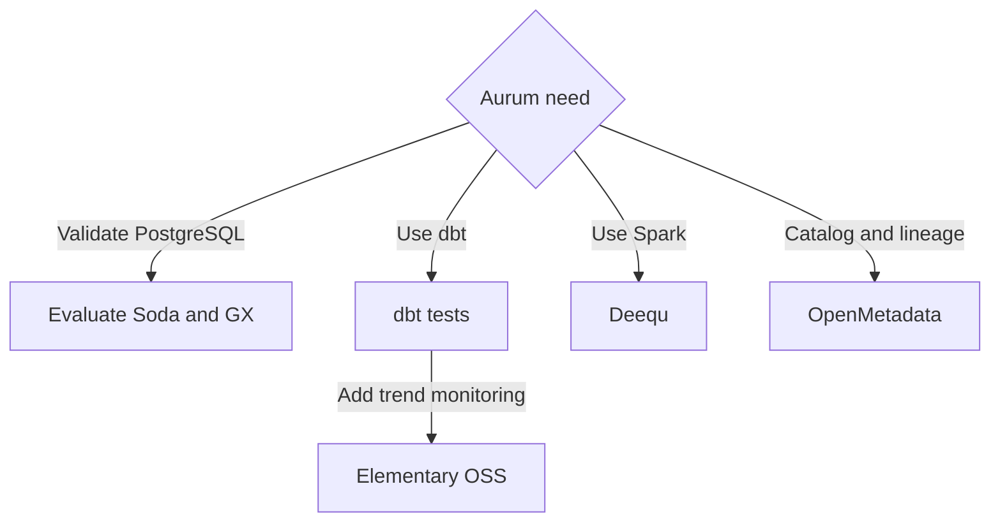
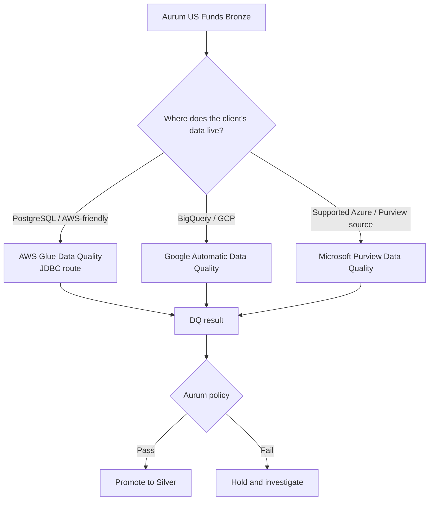
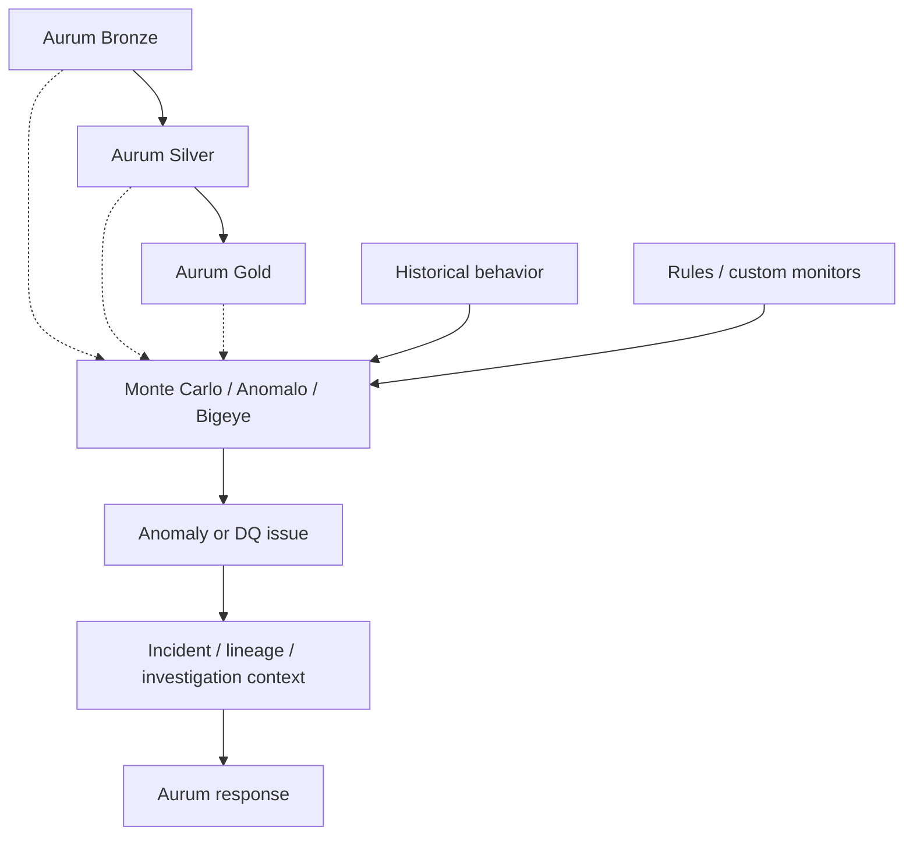

# Aurum diagrams

[Home](../README.md) · [Group 1 guide](group1-tools.md) · [Group 2 guide](group2-tools.md) · [Group 3 guide](group3-tools.md) · [Sources](sources.md)

## 1. The proposed Aurum quality flow



Bronze holds raw data. A DQ tool evaluates rules and returns results. Aurum's policy decides whether the data can move to Silver. Gold contains business outputs built from Silver.

A failed tool execution must be recorded as an execution error, not treated as a passing validation.

---

## 2. Group 1 — tools Aurum manages directly



Group 1 tools are mostly code-first or self-managed options. The exact fit depends on whether Aurum is using PostgreSQL, dbt, Spark, or a catalog platform.

See [Group 1 tools](group1-tools.md).

---

## 3. Group 2 — managed cloud DQ services



The simplest difference is:

- **AWS Glue Data Quality**: most direct Group 2 path for the current PostgreSQL-first prototype because of JDBC.
- **Google Automatic Data Quality**: natural when data is already in BigQuery or another supported Google-side table.
- **Microsoft Purview Data Quality**: natural for Microsoft/Azure environments using supported Purview DQ sources.

See [Group 2 tools](group2-tools.md).

---

## 4. Group 3 — commercial data observability



Group 3 is broader than a simple rule runner.

These tools can still run explicit rules, but their main emphasis is:

```text
continuous monitoring
+ learned anomalies
+ incidents
+ investigation context
+ lineage/impact where supported
```

For the US Funds example, think:

```text
normal comparable reload ≈ 75M rows
later reload = 40M rows
        ↓
observability platform flags unusual behavior
```

See [Group 3 tools](group3-tools.md).

---

## 5. US Funds example used across the groups

The research uses the same current Aurum dataset so the tools are easy to compare:

```text
29 physical CSV files
        ↓
4 logical tables

mutual_funds
mutual_fund_prices
etfs
etf_prices
```

The main teaching example is `mutual_fund_prices`, built from the A-Z files and containing about 75.7 million rows in the completed run.

Common candidate checks:

```text
fund_symbol is present
price_date is present
fund_symbol + price_date does not repeat
price follows the agreed range
price symbol exists in metadata
load volume matches expected scope
```

One fund appears on many dates, so `fund_symbol` alone must not be treated as unique in a price-history table.

---

## 6. How to read the per-tool diagrams

### Group 1

| Diagram | What to notice |
|---|---|
| Soda | Rules and table feed a scan; Aurum decides what follows |
| GX | Data and a suite meet in a validation workflow |
| dbt | Tests can sit before and after transformation |
| Deequ | PostgreSQL data must first become a Spark DataFrame |
| Elementary | Current metrics are compared with historical metrics |
| OpenMetadata | Metadata and DQ results feed a shared table view |

### Group 2

| Diagram | What to notice |
|---|---|
| AWS Glue DQ | PostgreSQL can connect through JDBC before AWS runs the checks |
| Google Automatic DQ | Current PostgreSQL data needs to be available in a supported Google table |
| Microsoft Purview DQ | First confirm that the source is supported for Purview Data Quality |

### Group 3

| Diagram | What to notice |
|---|---|
| Monte Carlo | PostgreSQL monitors compare current behavior with expected behavior; Postgres lineage is not listed in the current connector support |
| Anomalo | Historical patterns and explicit rules both feed monitoring |
| Bigeye | Profiling produces metrics/rules, which feed incidents and lineage-aware investigation |

All diagrams describe proposed integrations. They are alternatives or complementary pieces, not tools that all need to be deployed together.
