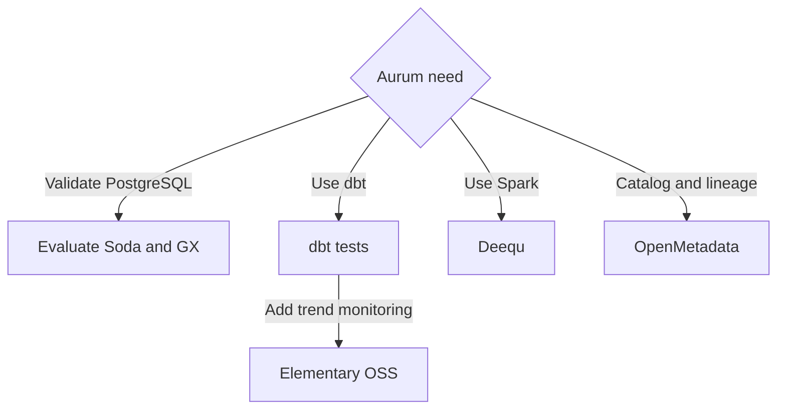

# Aurum diagrams

[Home](../README.md) · [Six tool walkthroughs](group1-tools.md) · [Sources](sources.md)

## 1. The proposed Aurum quality flow

Bronze holds raw data. A tool evaluates rules and returns results. Aurum's policy decides whether the validated data can move to Silver. Gold contains business outputs built from Silver.

A warning can be allowed or held according to the rule policy. A failed tool execution must be recorded as an execution error, not treated as a passing validation.

Holding a load and quarantining individual rows are different actions. Row quarantine requires enough evidence to identify the failing records.

## 2. Where the six tools fit

These are different needs, so the tools can complement one another. A catalog can sit alongside a validation runner. Historical monitoring can complement explicit rules.

## 3. How to read the tool diagrams

The [Group 1 guide](group1-tools.md) contains a diagram for every tool.

| Diagram | What to notice |
|---|---|
| Soda | Rules and table feed a scan; Aurum decides what follows |
| GX | Data and a suite meet in a Validation Definition; a Checkpoint runs it |
| dbt | Test sources before dependent builds; test candidates before publishing |
| Deequ | PostgreSQL data must first be available as a Spark DataFrame |
| Elementary | Current metrics are compared with history |
| OpenMetadata | Metadata and DQ workflows feed a shared table view |

Solid arrows show data, results or workflow order. Dashed arrows show optional services or integrations.

All diagrams describe proposed integrations. Per-tool diagrams show alternatives, not six tools that must all be deployed.
