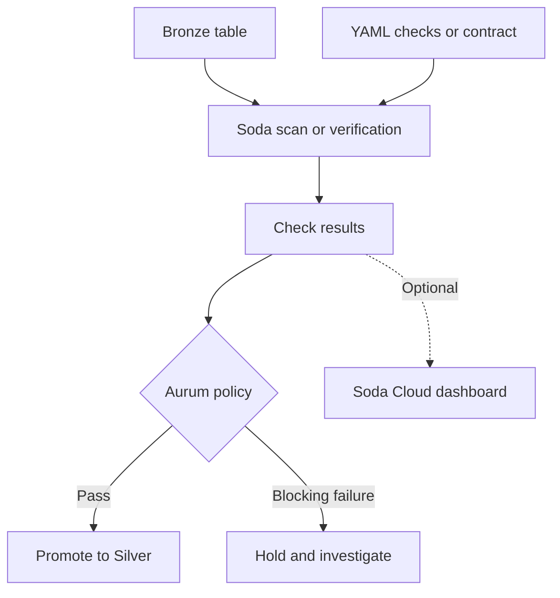
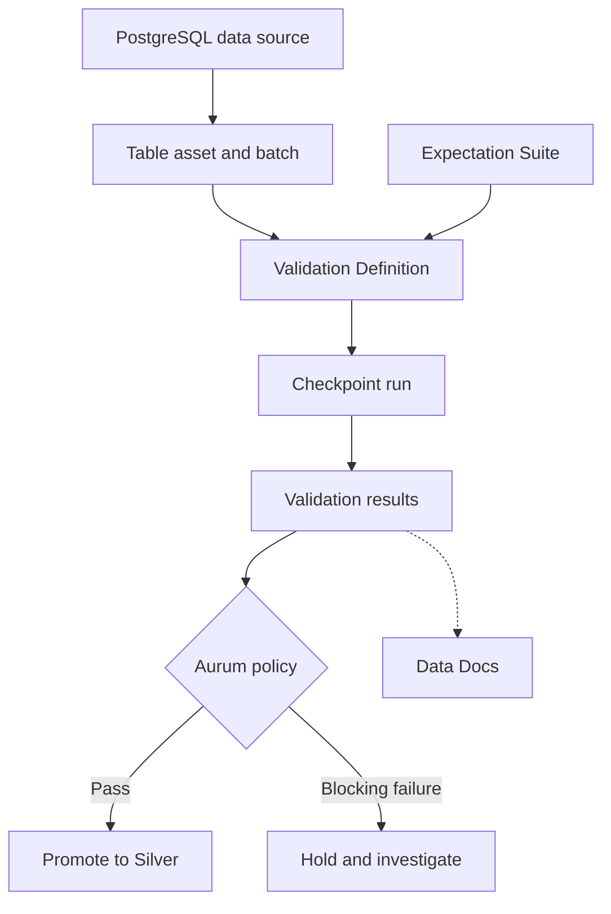
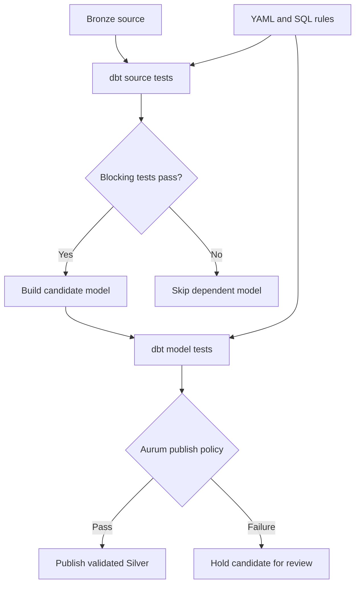
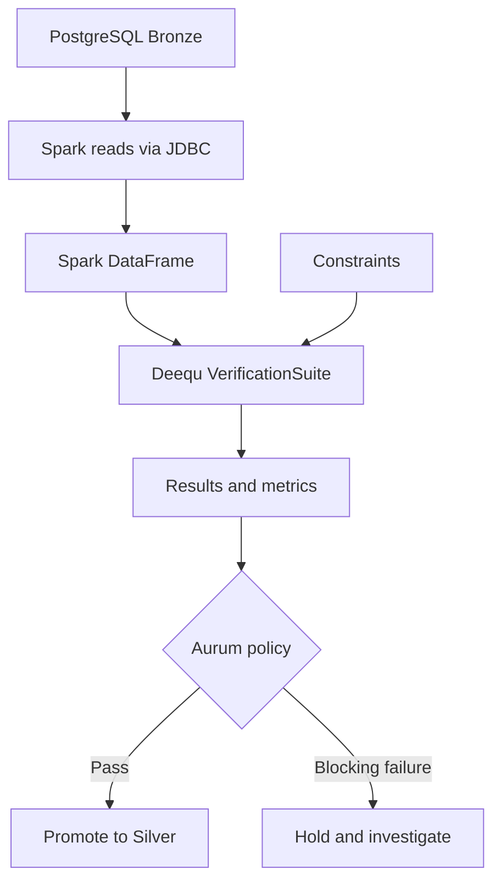
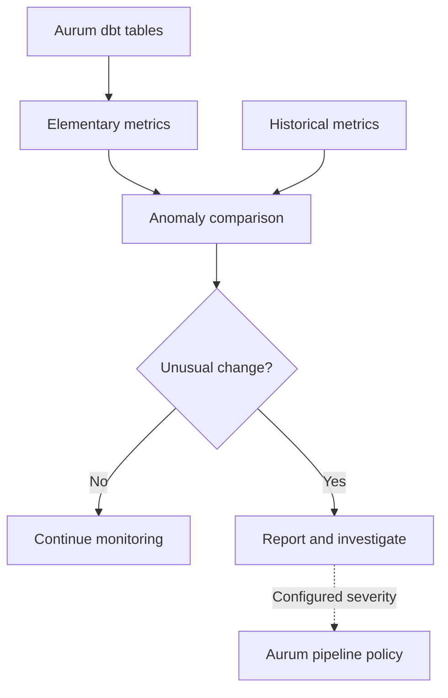
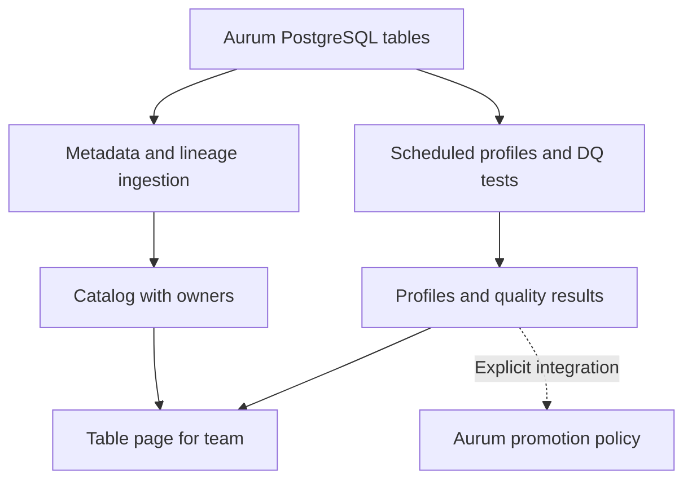

# Group 1 tools for Aurum

[Home](../README.md) · [Aurum diagrams](diagrams.md) · [Sources](sources.md)

## The shared Aurum example

Aurum's US Funds work includes `mutual_fund_prices`, built from the A–Z files. The earlier project run reported 75,657,739 rows in this logical table. This is historical data, not a daily incoming volume.

For these teaching examples, imagine a Bronze table named `bronze.mutual_fund_prices` with `fund_symbol`, `price_date` and `price`. **`price` is a teaching alias: map it to the actual price column before implementation.** The schema name is also illustrative.

Candidate rules:

| Rule | Why Aurum would use it |
|---|---|
| Symbol and date are present | Identify the fund and the day |
| Symbol + date is unique | Avoid counting the same fund-day twice |
| Price follows an agreed range | Detect invalid numeric values |
| Price symbol exists in fund metadata | Avoid price records with no matching fund |
| Load volume matches the expected scope | Detect incomplete ingestion |

The owner must confirm required columns, the record key and price limits. A symbol repeats across dates, so **`fund_symbol` alone must not be tested as unique in a price-history table**.

### One failure to follow through the tools

These invented rows illustrate the candidate rules. They are not findings from the completed scan.

| Symbol | Date | Price | Candidate issue |
|---|---|---:|---|
| ABCDX | 2021-01-04 | 25.40 | None |
| NULL | 2021-01-04 | 18.00 | Missing symbol |
| ABCDX | 2021-01-04 | 26.10 | Repeated symbol + date |
| XYZDX | 2021-01-05 | -3.00 | Negative price |

A rule result does not automatically move data or quarantine it. **Aurum owns scheduling, severity, promotion and quarantine.** A blocking failure can hold the load. Row-level quarantine also needs failing-row evidence and stable record identifiers.

## 1. Soda Core

**Simple idea:** engineers describe expected data in YAML. Soda evaluates it against PostgreSQL and returns results.



In the sample, missing-symbol and duplicate-pair rules fail. Aurum reads those outcomes and holds the load if they are blocking.

A legacy **Soda v3 / SodaCL** illustration:

```yaml
checks for mutual_fund_prices:
  - missing_count(fund_symbol) = 0
  - missing_count(price_date) = 0
  - duplicate_count(fund_symbol, price_date) = 0
  - min(price) >= 0
```

This example rejects negative prices. Zero-price treatment needs a separate agreed rule. Configure the Bronze schema in the connection and scope the checks to the intended load.

**Fit:** readable, version-controlled rules for a PostgreSQL pipeline. **Tradeoff:** Aurum still needs result storage, scheduling and its own response logic. Soda Cloud adds a hosted experience with features depending on the product and plan.

**Version matters:** v3 uses `soda-core-postgres`, SodaCL and `soda scan`. Current v4 uses `soda-postgres` and data contracts. Both package families are available on public PyPI according to the current repository. Choose and pin a version before copying examples. [Soda sources](sources.md#soda).

## 2. Great Expectations — GX Core

**Simple idea:** Aurum builds a reusable validation workflow in Python.



Here is what the terms mean in this example:

| GX term | Aurum meaning |
|---|---|
| Data Context | Project configuration and stored validation setup |
| Data Source | PostgreSQL connection |
| Asset | The Bronze price table |
| Batch | The exact load or partition being tested |
| Expectation | One rule, such as symbol is present |
| Suite | The collection of price-table rules |
| Validation Definition | Links the batch definition with the suite |
| Checkpoint | Runs validation definitions and configured actions |
| Data Docs | Generated pages showing rules and results |

For the sample, Aurum creates missing-value, compound-key and price Expectations. The Checkpoint returns failed validations. Aurum then applies its promotion policy.

**Fit:** useful when Aurum needs reusable suites, Python control and configurable reporting. **Tradeoff:** more configuration concepts to manage. Aurum provides the schedule and production integration; Data Docs need generation and hosting. “More structured” describes the workflow, not proof that GX is faster or better. [GX sources](sources.md#great-expectations).

## 3. dbt tests

**Simple idea:** if Aurum uses dbt to build tables with SQL, put quality checks beside those sources and models.



A dbt source test can catch the sample's missing symbol before a dependent Silver model builds. A custom SQL test can return repeated symbol-date pairs or prices outside the agreed range. Built-in tests cover `not_null`, `unique`, `accepted_values` and `relationships`.

**Fit:** keeps transformation and validation in one dbt project. **Tradeoff:** adopting dbt adds a transformation framework. It is unnecessary to introduce it solely for a few DQ checks.

With `dbt build`, blocking upstream failures skip dependent resources. `dbt test` by itself does not undo a table that was already built. Use a candidate schema or Aurum publish step if data must remain hidden until model tests pass. `store_failures` can save failing test rows for review; it does not implement Aurum quarantine. [dbt sources](sources.md#dbt).

## 4. Deequ

**Simple idea:** check data inside Spark. Deequ is an Amazon open-source library, distinct from the managed AWS Glue Data Quality service.



Spark reads the Bronze price table into a DataFrame, which is Spark's table structure. Deequ's `VerificationSuite` evaluates completeness, compound uniqueness and price constraints. It returns metrics and constraint outcomes for Aurum to interpret.

**Fit:** useful when Aurum already processes data with Spark. It also supports profiling, constraint suggestions and historical metrics. **Tradeoff:** Spark, Java and matching library versions add operational work to a PostgreSQL-first design.

The 75.7M-row size alone does not prove Spark is required. Benchmark PostgreSQL queries and Spark extraction before choosing. Deequ 2.1.0 and later require Java 11 according to the current README; earlier 2.0.x releases require Java 8. Match the artifact to the Spark release. [Deequ source](sources.md#deequ).

## 5. Elementary OSS

**Simple idea:** add historical monitoring to an existing dbt project.



Imagine comparable complete reloads normally produce around 75.7M rows, but a later reload produces 40M. These are hypothetical reload totals, not daily new records or measured historical runs. Elementary's volume test may flag the drop after enough comparable history is available.

**Fit:** complements explicit dbt rules with volume, freshness and column anomaly checks. **Tradeoff:** history and tuning are needed. Weekends, market holidays and partial loads can otherwise create misleading alerts.

For volume anomalies, a timestamp column is recommended for time buckets, but optional: without it, the test counts total table rows. The business `price_date` is not an ingestion timestamp. For load monitoring, use appropriate load metadata.

The OSS dbt package depends on a dbt project. Elementary Cloud can work without dbt. Failed tests only block when configured with blocking severity and used in the pipeline. [Elementary sources](sources.md#elementary).

## 6. OpenMetadata

**Simple idea:** give the team a searchable table page with ownership, descriptions, lineage, profiles and quality results.



Manjula could open `mutual_fund_prices` and see who owns it, its columns, its quality results and how it connects to downstream data. Metadata ingestion collects descriptions and structure. Profiling and DQ pipelines separately query data and evaluate tests.

**Fit:** useful when Aurum needs catalog and quality visibility together. **Tradeoff:** running a platform adds more services and operations than a validation library.

A PostgreSQL connection does not automatically discover all A–Z file lineage or every Bronze-to-Gold transformation. Configure the supported lineage workflows and supply missing relationships. Feeding test results into Aurum's promotion gate also needs an explicit integration. [OpenMetadata source](sources.md#openmetadata).

## Compare the choices

| Tool | Engineering input | Main output | Extra context needed |
|---|---|---|---|
| Soda Core | YAML checks or contracts | Rule results and metrics | Version selection |
| GX Core | Python suites and validation setup | Validation results and Data Docs | Python integration |
| dbt tests | YAML and SQL | Test outcomes and optional failed rows | dbt project |
| Deequ | Spark constraints | Constraint results and metrics | Spark and compatible Java |
| Elementary OSS | dbt monitoring configuration | Anomaly results, reports and alerts | dbt and comparable history |
| OpenMetadata | Connector and test configuration | Catalog, lineage, profiles and DQ UI | Platform deployment and ingestion |

## What Aurum should test first

Evaluate **Soda Core and GX Core** against the same PostgreSQL data and agreed rules. This is an architectural shortlist, not a measured ranking.

Compare rule coverage, query runtime, database load, failed-row evidence, Python integration and operational effort. Include cross-table relationships and compound keys. Test a clean load, a broken load and a tool execution error. Aurum must distinguish **failed quality** from **checks that did not run**.

Start with a small representative load, then run the selected setup at the real table scale. Keep run IDs and record identifiers in the evidence. After comparison, choose the tool that fits the measured requirements.
