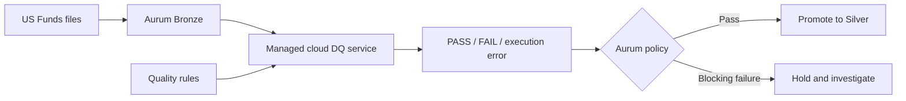
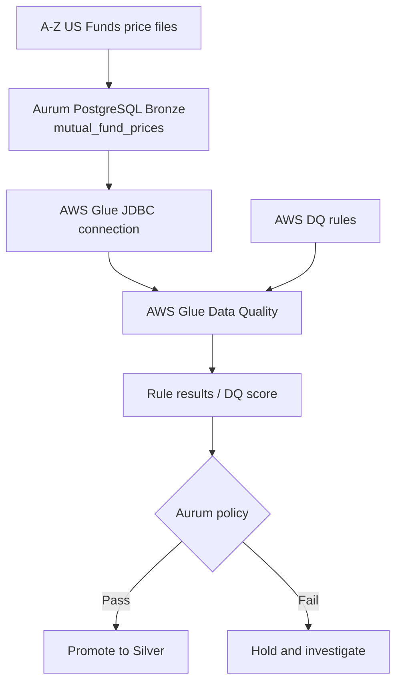
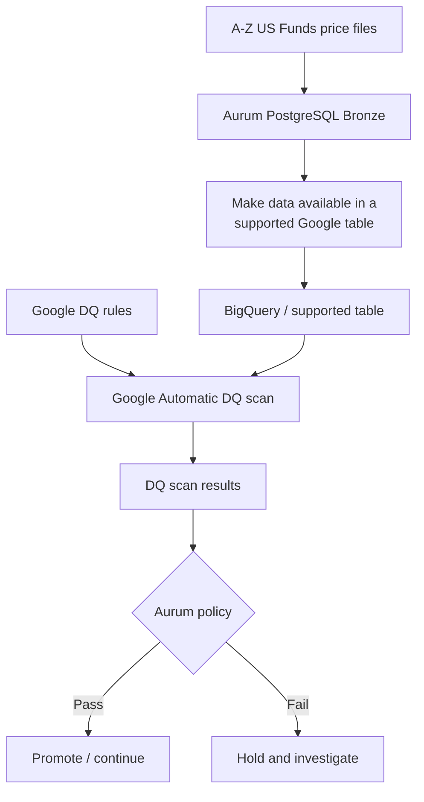
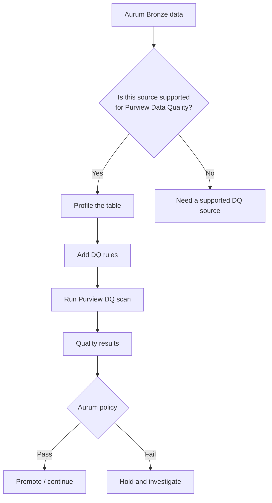
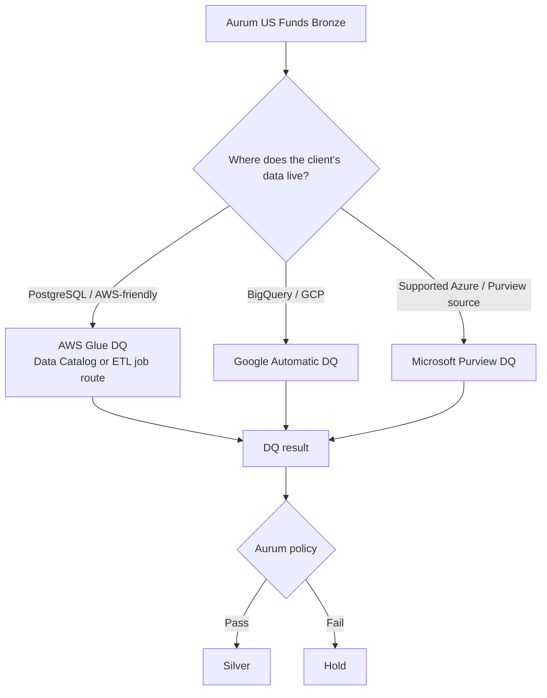

# Group 2 tools for Aurum

[Home](../README.md) · [Aurum diagrams](diagrams.md) · [Group 1 guide](group1-tools.md) · [Group 3 guide](group3-tools.md) · [Group 4 guide](group4-tools.md) · [Sources](sources.md)

## What Group 2 means

Group 2 contains **cloud-managed data-quality services**.

The simplest way to think about them is:

> Group 1: Aurum runs or manages the DQ tool.  
> Group 2: AWS, Google, or Microsoft runs the DQ service for us.

The cloud service checks the data and returns results. **Aurum still decides what happens next.**



A cloud DQ service does not replace Aurum. Aurum still owns the pipeline, promotion rules, evidence, reporting, and failure handling.

---

## Our shared Aurum example — US Funds

The current US Funds dataset has **29 physical CSV files** mapped into four logical tables:

| Logical table | Rows from the completed run | What it contains |
|---|---:|---|
| `mutual_funds` | 23,783 | Mutual-fund details |
| `mutual_fund_prices` | 75,657,739 | Mutual-fund price history from A-Z files |
| `etfs` | 2,310 | ETF details |
| `etf_prices` | 3,866,030 | ETF price history |

For the examples below, focus on:

```text
A.csv to Z.csv
      ↓
Bronze mutual_fund_prices
      ↓
~75.7 million rows
```

Imagine these rows appear in Bronze:

| fund_symbol | price_date | price | Problem |
|---|---|---:|---|
| ABCDX | 2021-01-04 | 25.40 | None |
| NULL | 2021-01-04 | 18.00 | Missing fund symbol |
| ABCDX | 2021-01-04 | 26.10 | Same fund + date as row 1 |
| XYZDX | 2021-01-05 | -3.00 | Invalid if agreed rule is price >= 0 |

Candidate Aurum checks:

1. `fund_symbol` should be present.
2. `price_date` should be present.
3. `fund_symbol + price_date` should not repeat.
4. Price should follow the agreed range.
5. Every price symbol should exist in the metadata table.
6. The load should contain the expected files/rows.

Important: **`fund_symbol` alone is not unique in a price-history table.** One fund appears on many dates.

---

# 1. AWS Glue Data Quality

## Simple meaning

**AWS Glue Data Quality = AWS runs the data-quality checks for us.**

Aurum does not need to host the DQ engine itself.

For our current setup, AWS Glue has two different Data Quality routes that we should keep separate:

1. **Data Catalog Data Quality** checks tables registered in the AWS Glue Data Catalog.
2. **ETL job Data Quality** runs DQ inside an AWS Glue ETL job while data is flowing through that job.

For the Data Catalog route, JDBC is listed as supported when AWS Lake Formation is disabled. However, the same supported-source table lists **Amazon RDS and Aurora** as not supported in that Lake Formation disabled column.

So if Aurum PostgreSQL is running on Amazon RDS or Aurora, we should check the exact Data Catalog connection route before assuming it will work.

JDBC simply means a standard database connection.

## Aurum + US Funds flow



## What happens in our example?

Suppose Aurum loads A-Z files into `bronze.mutual_fund_prices`.

AWS Glue checks:

```text
fund_symbol missing?
price_date missing?
fund_symbol + price_date duplicated?
price outside the agreed range?
```

If Glue finds the bad rows above, it returns failed rule results.

Then:

```text
AWS Glue says: FAIL
        ↓
Aurum decides:
hold the load
show the issue
do not promote to Silver
```

The important point is:

> **AWS detects the problem. Aurum decides what to do with it.**

## Data Catalog route versus ETL job route

### Data Catalog route

This route evaluates tables that are already registered in the AWS Glue Data Catalog.

For this route, the supported-source table says:

```text
JDBC
Lake Formation disabled
Supported
```

But it separately says:

```text
Amazon RDS and Aurora
Lake Formation disabled
Not Supported
```

That distinction matters for Aurum. If our PostgreSQL database is hosted on RDS or Aurora, we should verify the exact supported route before choosing the Data Catalog option.

### ETL job route

This is a different path.

AWS Glue Data Quality can run inside an AWS Glue ETL job against data that the job has already read. AWS documents this route separately from Data Catalog Data Quality, and it supports the data sources available to Glue ETL jobs.

For Aurum, this means we should first decide whether we are:

```text
checking a cataloged table
or
running DQ inside a Glue ETL job
```

before we design the PostgreSQL integration.

## Main catch

Managed does **not** mean zero setup.

We still need things such as:

```text
AWS account
IAM permissions
network access
Glue connection
configuration
cloud cost
```

### Easy meeting line

> "AWS Glue has two DQ routes. The Data Catalog route supports JDBC when Lake Formation is disabled, but its source table separately marks Amazon RDS and Aurora as not supported in that case. The ETL job route is separate and runs DQ inside a Glue job. So for Aurum PostgreSQL, especially on RDS or Aurora, we should confirm the exact route first."

[Official references](sources.md#aws-glue-data-quality)

---

# 2. Google Automatic Data Quality

## Simple meaning

**Google Automatic Data Quality = Google runs managed DQ scans on supported Google-side tables.**

The most important example is **BigQuery**.

BigQuery is Google's cloud data warehouse.

## Why this is different for Aurum

Our current Aurum prototype is:

```text
US Funds
   ↓
PostgreSQL Bronze
```

Google Automatic Data Quality is more naturally used like this:

```text
Data
 ↓
BigQuery / supported Google table
 ↓
Google DQ scan
```

So for our current PostgreSQL setup, there is an **extra step**.

## Aurum + US Funds flow



## What happens in our example?

If `mutual_fund_prices` is available in BigQuery, Google can check things such as:

```text
fund_symbol is not null
price_date is not null
price is in the valid range
custom SQL checks for duplicates or relationships
```

Google returns the scan result.

Aurum then decides whether the load can continue.

## When would this make sense?

Imagine an Aurum customer already stores everything in BigQuery.

Then:

```text
Customer BigQuery
      ↓
Google DQ
      ↓
Aurum
```

This is a natural fit.

## Main catch for our current prototype

Our current Bronze data is in PostgreSQL, not BigQuery.

So using Google DQ only for this prototype would add another data-platform step.

### Easy meeting line

> "Google DQ is simple when the client's data is already in BigQuery. For our current PostgreSQL US Funds setup, it needs an extra supported Google-side table, so it is not the most direct path."

[Official references](sources.md#google-cloud-automatic-data-quality)

---

# 3. Microsoft Purview Data Quality

## Simple meaning

**Microsoft Purview Data Quality = Microsoft provides managed data-quality checks together with governance features.**

It can help teams understand and manage things like:

```text
what tables exist
who owns them
what columns they contain
what quality rules apply
what quality result was found
```

So Purview is broader than a simple DQ checker.

## Aurum + US Funds flow



That first question — **is the source supported for Purview Data Quality?** — matters a lot for Aurum.

## The PostgreSQL point

Microsoft Purview can connect to PostgreSQL for **metadata / Data Map** purposes.

That can help Purview understand that a table exists and what columns it has.

But:

> PostgreSQL support in Purview metadata does **not** automatically mean PostgreSQL is supported for Purview Data Quality scans.

In the current Purview Data Quality supported-source list used by this research, PostgreSQL is not listed as a direct DQ source.

So for our current setup:

```text
PostgreSQL metadata in Purview
        → possible

Purview DQ directly on PostgreSQL
        → not the direct supported path in this research
```

## US Funds example

If the US Funds tables were in a supported Purview DQ source, Purview could do:

```text
mutual_fund_prices
      ↓
profile the table
      ↓
check completeness
check uniqueness
check validity
check freshness
      ↓
DQ result
      ↓
Aurum policy
```

## When would this make sense?

Imagine an Aurum customer already uses Azure and Purview for governance.

Then Purview may already be their standard place for:

- catalog
- ownership
- governance
- data quality

Aurum could consume those DQ results instead of forcing a completely separate stack.

## Main catch for our current prototype

For the PostgreSQL-first US Funds prototype, Purview Data Quality is not the direct path we would test first.

It is also a larger governance platform, so adopting it only for a few checks would be heavy.

### Easy meeting line

> "Purview is useful for Microsoft-heavy enterprise environments because it combines governance and DQ. For our current PostgreSQL US Funds prototype, PostgreSQL is useful for Purview metadata, but it is not the direct Purview DQ source path we are targeting."

[Official references](sources.md#microsoft-purview-data-quality)

---

# The easiest way to compare all three



The quality question can be the same in every case.

The main difference is **where the DQ engine runs and where the data already lives**.

---

# One US Funds problem across all three

Suppose Bronze contains:

```text
NULL  | 2021-01-04 | 18.00
ABCDX | 2021-01-04 | 25.40
ABCDX | 2021-01-04 | 26.10
XYZDX | 2021-01-05 | -3.00
```

Aurum asks:

```text
Is fund_symbol missing?
Is fund_symbol + price_date repeated?
Does price break the agreed rule?
```

The tool choice changes the route:

```text
AWS:
PostgreSQL → AWS Glue DQ → result → Aurum

Google:
PostgreSQL → supported Google table → Google DQ → result → Aurum

Microsoft:
supported Purview DQ source → Purview DQ → result → Aurum
```

The business question stays the same.

---

# Why Group 2 matters to Aurum

Aurum may eventually support customers on different cloud stacks.

Example:

```text
Customer A already uses AWS
        → AWS Glue DQ may fit

Customer B already uses BigQuery
        → Google DQ may fit

Customer C already uses Azure + Purview
        → Purview DQ may fit
```

This means Aurum does not necessarily need to force every customer to use the same DQ engine.

Aurum can stay focused on:

```text
orchestration
promotion policy
evidence
reporting
Bronze → Silver decision
```

while using the customer's existing cloud DQ service where that makes sense.

---

# Simple comparison

| Tool | Very simple meaning | Fit with current PostgreSQL prototype | Best situation |
|---|---|---|---|
| AWS Glue Data Quality | AWS runs the DQ checks | JDBC is supported in the Data Catalog route when Lake Formation is disabled, but RDS and Aurora have a separate support caveat | AWS / PostgreSQL-friendly client |
| Google Automatic Data Quality | Google runs DQ scans | Needs supported Google-side table | BigQuery / GCP client |
| Microsoft Purview Data Quality | Microsoft runs DQ + governance | PostgreSQL is not the direct DQ path used here | Azure / Purview enterprise client |

---

# What Aurum should test first in Group 2

For our **current PostgreSQL-first US Funds prototype**:

### AWS Glue Data Quality

This is still the Group 2 service to investigate first for PostgreSQL, but the route must be checked carefully. Data Catalog DQ supports JDBC when Lake Formation is disabled, while Amazon RDS and Aurora are separately listed as not supported in that same source table. The ETL job route is separate.

### Google Automatic Data Quality

Keep it as the GCP / BigQuery option.

### Microsoft Purview Data Quality

Keep it as the Microsoft / Purview option for supported DQ sources.

This is an **architecture-fit conclusion**, not a benchmark saying one product is better than the others.

---

# If we run a Group 2 POC

Use the same US Funds checks and the same three test situations:

```text
1. Clean load
2. Bad load
3. Cloud DQ job fails or cannot run
```

Aurum must always distinguish:

```text
PASS
FAIL
CHECK DID NOT RUN
```

A cloud-service error must **never** be treated as a DQ pass.

Compare:

- connection effort
- rule coverage
- failed-row evidence
- runtime
- source-database load
- Aurum API/result integration
- cloud cost
- security and network setup

Start with a smaller representative load before testing the full ~75.7M-row table.

---

# Meeting-ready explanation

> "Group 2 is the managed-cloud group. Instead of Aurum hosting the DQ engine, AWS, Google, or Microsoft runs the checks for us. We still use the same US Funds checks, like missing fund symbols, duplicate fund-plus-date records, and invalid prices. For AWS Glue, we must first choose between the Data Catalog route and the ETL job route. JDBC is supported in the Data Catalog route when Lake Formation is disabled, but Amazon RDS and Aurora have a separate support caveat. Google's DQ is more natural when the data is already in BigQuery. Purview is more natural in Microsoft and Azure environments, but PostgreSQL is not the direct Purview DQ source path we are targeting. In every case, the cloud tool checks the data, while Aurum still decides whether Bronze can move to Silver."
