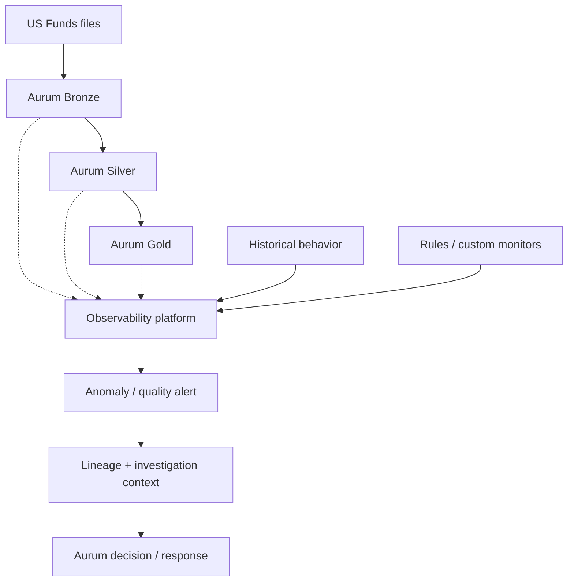
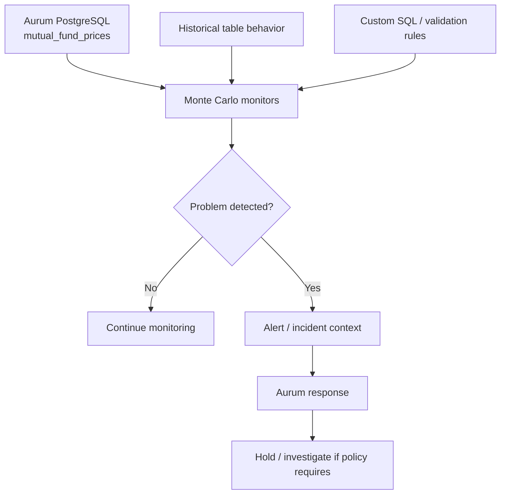
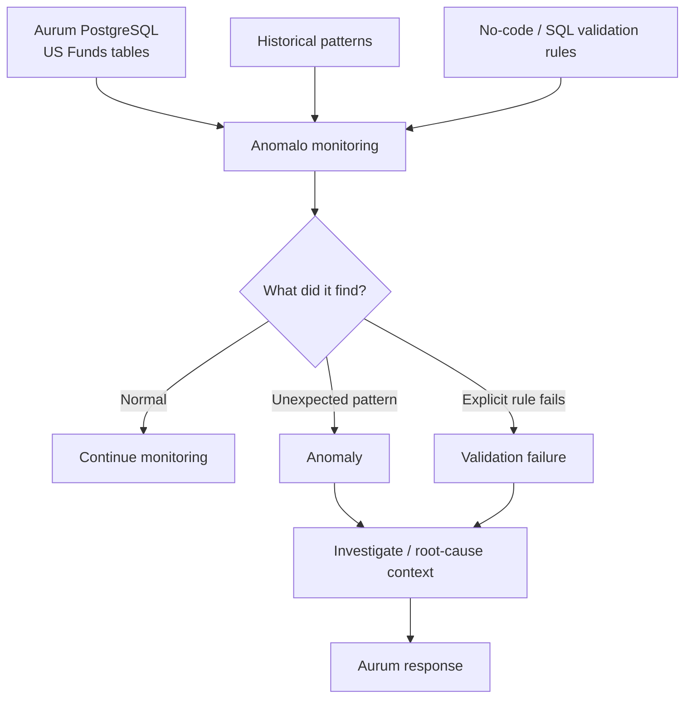
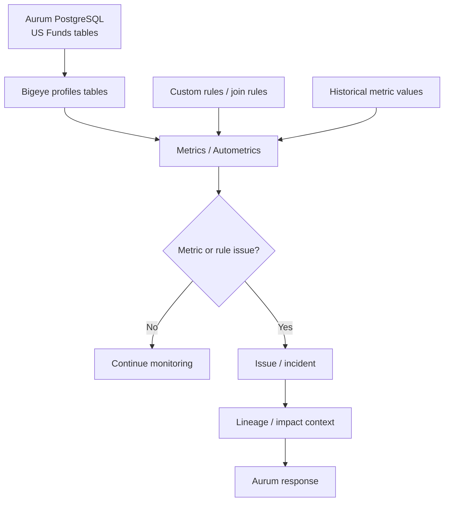

# Group 3 tools for Aurum

[Home](../README.md) · [Aurum diagrams](diagrams.md) · [Group 1 guide](group1-tools.md) · [Group 2 guide](group2-tools.md) · [Sources](sources.md)

## What Group 3 means

Group 3 contains **commercial data-observability platforms**:

1. Monte Carlo
2. Anomalo
3. Bigeye

The easiest way to think about this group is:

> Group 1 mainly starts from rules we define.  
> Group 3 watches data continuously, learns normal behavior, detects unusual changes, and helps investigate what broke.

That does **not** mean Group 3 cannot run normal rules. All three also support explicit checks in some form. Their bigger value is broader monitoring, anomaly detection, incident investigation, and lineage/context.

## What "data observability" means in Aurum

A simple DQ rule asks:

```text
Is fund_symbol NULL?
Is price negative?
Is fund_symbol + price_date duplicated?
```

Observability asks a wider question:

```text
Does this table look different from normal?
Did its volume suddenly drop?
Did it stop updating?
Did its schema change?
Which downstream table/dashboard may be affected?
Where did the problem likely start?
```

For Aurum, think of Group 3 as a **watching and investigation layer** around the pipeline.



Important:

> The observability tool tells Aurum that something is wrong and gives context. Aurum still owns its own promotion, hold, quarantine, or release policy unless an explicit pipeline integration is built.

---

# Shared Aurum example — US Funds

The current US Funds dataset contains **29 physical CSV files** mapped into four logical tables:

| Logical table | Rows from completed run | Meaning |
|---|---:|---|
| `mutual_funds` | 23,783 | Mutual-fund metadata |
| `mutual_fund_prices` | 75,657,739 | Mutual-fund price history from A-Z files |
| `etfs` | 2,310 | ETF metadata |
| `etf_prices` | 3,866,030 | ETF price history |

For Group 3, the most useful example is:

```text
A.csv to Z.csv
      ↓
Bronze mutual_fund_prices
      ↓
~75.7 million historical rows
```

Group 3 becomes especially useful when Aurum runs repeatedly.

Imagine comparable complete reloads look like:

```text
Run 1: 75.6M rows
Run 2: 75.8M rows
Run 3: 75.5M rows
Run 4: 75.7M rows
```

Then a later comparable reload gives:

```text
Run 5: 40.0M rows
```

Every one of those 40M rows might still pass basic rules such as:

```text
fund_symbol present
price_date present
price valid
no duplicate fund + date
```

But the load still looks suspicious.

That is the kind of situation where observability platforms are useful.

---

# 1. Monte Carlo

## Simple meaning

**Monte Carlo watches data continuously and alerts when the behavior looks unusual.**

It can monitor things such as:

- volume
- freshness
- schema changes
- metrics
- validation rules
- custom SQL
- anomalies over time

It also has broader lineage and incident/investigation features across supported parts of a data stack.

## Aurum + US Funds flow



## US Funds example — sudden volume drop

Suppose comparable full reloads normally contain around 75.7M rows.

A later comparable reload has 40M rows.

Monte Carlo can use volume monitoring to detect an abnormal change.

Simple meaning:

> "Usually this table behaves one way. This run is very different."

That is different from hard-coding:

```text
row_count must equal exactly 75,657,739
```

because automated thresholds can learn from historical behavior.

## Explicit rules still matter

We may already know a business rule:

```text
fund_symbol must not be NULL
```

Monte Carlo also supports validation and custom SQL monitors. Observability does not replace deterministic DQ rules.

## PostgreSQL point for Aurum

Monte Carlo has a documented PostgreSQL integration.

Its current PostgreSQL documentation lists support for:

- freshness through opt-in row counts
- volume through opt-in row counts
- schema changes
- metric monitors
- comparison monitors
- custom SQL
- validation monitors

One important limitation:

> The current PostgreSQL integration page does **not** list native PostgreSQL lineage support.

So we should not say that simply connecting Aurum PostgreSQL automatically gives us full lineage.

Also, opt-in freshness/volume monitoring can run `count(*)` queries. For the ~75.7M-row price table, database load should be measured in a POC.

## Why it could help Aurum

Monte Carlo becomes useful when Aurum wants more than pass/fail validation:

```text
continuous monitoring
+ learned anomalies
+ incidents
+ investigation context
+ broader stack observability
```

## Main catch

It is a broad commercial platform. For the current prototype, we need to prove that the observability value justifies adding a larger commercial system instead of a lighter validator.

### Easy meeting line

> "Monte Carlo is more of a continuous data-health monitor than only a rule checker. For our US Funds table it could detect unusual volume or freshness changes and also run custom validation rules. It supports PostgreSQL monitoring, but the current PostgreSQL docs do not show native lineage support, so we should not assume full lineage from that connection."

[Official references](sources.md#monte-carlo)

---

# 2. Anomalo

## Simple meaning

**Anomalo learns what normal data looks like and flags unusual data.**

It combines:

```text
automatic monitoring
+ anomaly detection
+ validation rules
+ profiling
+ investigation / root-cause context
+ lineage integrations
```

The important idea is that we do not need to manually invent a rule for every possible unexpected change.

## Aurum + US Funds flow



## US Funds example — values change unexpectedly

Imagine the row count still looks normal:

```text
75.7M rows
```

But the distribution of values in an important price column changes dramatically.

A simple row-count check may pass.

Anomalo's anomaly monitoring is intended to learn historical patterns and detect unexpected changes in the data itself.

Simple meaning:

> "The amount of data looks normal, but the data inside the table does not look like it normally does."

## Normal DQ rules are also possible

For an important table we may explicitly say:

```text
fund_symbol must not be NULL
```

Anomalo supports configurable validation rules, including no-code checks and custom SQL.

So Anomalo is not only anomaly detection.

## History matters

Learned anomaly detection needs history.

The public product material says the models learn historical behavior and improve as more history becomes available.

For Aurum this matters because our completed US Funds scan is one historical analysis. We should not pretend that one completed run is enough to benchmark learned anomaly detection properly.

## PostgreSQL point for Aurum

Anomalo's current integrations page publicly lists **PostgreSQL** as a data-source integration.

However, detailed integration documentation is private to customers and pilots.

Safe conclusion:

> PostgreSQL integration is publicly listed, but connector-specific permissions, query behavior, and exact feature coverage must be verified during a pilot.

## Why it could help Aurum

Anomalo is interesting if we want:

```text
broad automatic monitoring
+
deep value-level anomaly detection
+
explicit rules for important tables
```

For example:

```text
All four US Funds tables:
basic automatic monitoring

mutual_fund_prices:
deeper anomaly checks + important explicit rules
```

## Main catch

It is a commercial platform with a larger footprint than a lightweight validation library. Historical anomaly detection also needs comparable runs, and detailed PostgreSQL behavior needs a pilot because public connector documentation is limited.

### Easy meeting line

> "Anomalo learns historical patterns and can flag changes we did not explicitly write a rule for. For Aurum, that could catch a strange shift inside mutual_fund_prices even when row count looks normal. It also supports normal validation rules. PostgreSQL is listed as an integration, but the detailed connector documentation is private, so we would verify the exact setup in a pilot."

[Official references](sources.md#anomalo)

---

# 3. Bigeye

## Simple meaning

**Bigeye tracks data-health metrics and rules over time, detects anomalies, and helps investigate issues with lineage and incident context.**

A metric is simply a number that describes data health.

For our US Funds table, metrics could be:

```text
row count
null percentage of fund_symbol
average price
number of distinct symbols
hours since last load
```

Bigeye can track these over time and alert when they move outside expected behavior.

## Aurum + US Funds flow



## US Funds example

Suppose Bigeye tracks:

```text
row count of mutual_fund_prices
null % of fund_symbol
distinct fund symbols
average price
```

If a later run changes sharply, Bigeye can raise an issue because one or more monitored metrics moved outside expected behavior.

## Explicit rules are also possible

Bigeye documentation describes:

- Metrics
- Custom Rules
- Join Rules

So an Aurum-specific relationship check can still be explicit.

Example:

```text
Every symbol in mutual_fund_prices
should exist in mutual_funds
```

That should not be left only to anomaly detection.

## PostgreSQL point for Aurum

Bigeye has explicit PostgreSQL connection documentation.

The normal setup uses a read-only PostgreSQL user. After connection, Bigeye loads/profiles tables and can recommend monitoring.

Bigeye supports:

- direct/agentless connectivity
- an agent-based option that runs inside the customer's network

The agent option matters when an enterprise does not want a SaaS service connecting directly into its database network.

## Lineage point

Bigeye has a broader Lineage Plus capability. It uses lineage for upstream monitoring, impact analysis, root-cause investigation, and incident context.

But connector-specific lineage coverage should still be confirmed for the exact Aurum stack. We should not assume every PostgreSQL → Silver → Gold relationship appears automatically.

## Why it could help Aurum

Bigeye is interesting if we need:

```text
PostgreSQL monitoring
+ profiling
+ metrics
+ anomaly thresholds
+ explicit rules
+ incident workflow
+ lineage-aware investigation
```

## Main catch

It is much broader than a simple Bronze-to-Silver rule engine. Profiling and metrics also execute work against the source, so we should measure impact on the ~75.7M-row table.

### Easy meeting line

> "Bigeye tracks health metrics such as row count or null percentage over time and alerts when they behave abnormally. It supports PostgreSQL directly, can profile the US Funds tables, and also supports custom rules and lineage-aware investigation. For Aurum we would still benchmark source-database load and verify exactly how much lineage it can discover from our stack."

[Official references](sources.md#bigeye)

---

# How Group 3 differs from Group 1

This is the most important concept.

## Group 1 question

```text
"We know what bad data means.
Did this rule fail?"
```

Example:

```text
fund_symbol must not be NULL
```

## Group 3 question

```text
"We may not know every failure in advance.
Does the data or pipeline look unusual,
and where might the problem have started?"
```

Examples:

```text
row count suddenly drops
null rate jumps
table stops updating
schema changes
price distribution shifts unexpectedly
```

But the groups overlap.

Modern observability platforms can also run explicit rules.

The accurate picture is:

```text
Group 1
strong emphasis:
explicit validation and engineering-controlled rules

Group 3
strong emphasis:
continuous monitoring + anomalies + investigation + lineage/context
```

Do not explain this as:

```text
Group 1 = rules
Group 3 = no rules
```

That would be wrong.

---

# One Aurum incident across all three

Imagine a later comparable US Funds load behaves like this:

```text
Normal comparable load:
~75M mutual_fund_prices rows

Current load:
40M rows
```

### Monte Carlo

```text
Volume monitor
      ↓
abnormal volume detected
      ↓
alert / incident
```

### Anomalo

```text
Automatic monitoring / learned history
      ↓
unexpected behavior detected
      ↓
investigation context
```

### Bigeye

```text
Row-count metric
      ↓
metric outside expected behavior
      ↓
issue / incident
```

They solve a similar high-level problem:

> "Something changed unexpectedly. Tell the team quickly and help them investigate."

---

# Another incident — known business rule

Imagine:

```text
fund_symbol = NULL
```

We already know this is a rule we care about.

All three platforms can support explicit checks in some form.

That is why Group 3 is broader than "AI anomaly detection."

For Aurum, important deterministic rules should remain explicit even if an observability platform is also monitoring the table.

---

# Simple comparison

| Tool | Simple meaning | PostgreSQL relevance for Aurum | Important caution |
|---|---|---|---|
| **Monte Carlo** | Watches data health and anomalies, with incident context | Direct PostgreSQL monitoring is documented | Current Postgres docs do not list native lineage; opt-in row counts can query large tables |
| **Anomalo** | Learns normal patterns and finds unexpected changes; also supports rules | PostgreSQL is publicly listed as an integration | Detailed connector docs are private; exact PostgreSQL behavior needs a pilot |
| **Bigeye** | Tracks health metrics, rules and anomalies with lineage/incident context | Direct PostgreSQL connection is documented | Benchmark monitoring load and verify exact lineage coverage |

---

# Does Aurum need Group 3 right now?

Not necessarily for the first DQ POC.

Our immediate requirement is still:

```text
Bronze PostgreSQL
      ↓
known DQ rules
      ↓
PASS / FAIL
      ↓
Aurum policy
```

That is why Soda/GX remain easier initial validation candidates.

Group 3 becomes more valuable when the requirement expands to:

```text
monitor many datasets continuously
learn normal behavior
detect unknown problems
trace impact
manage incidents
help investigate root cause
```

So Group 3 should be treated as:

> **a broader observability option for Aurum, not automatically a replacement for the core validation layer.**

---

# If we run a Group 3 POC

Use the same US Funds data, but do not test only static bad rows.

## Test A — known DQ failure

Prepare examples such as:

```text
missing fund_symbol
duplicate fund_symbol + price_date
invalid price
orphan symbol
```

Check whether the platform detects the problem, shows useful evidence, and exposes a result Aurum can consume.

## Test B — anomaly

Create comparable run history and then simulate:

```text
large row-count drop
large null-rate increase
schema change
unusual value distribution
late/stale table
```

Check:

```text
Did it detect the change?
How much history was needed?
Was the alert useful?
How many false alerts appeared?
```

## Test C — tool failure

Simulate:

```text
database unavailable
permissions removed
monitor job fails
```

Aurum must distinguish:

```text
DATA PASSED
DATA FAILED
MONITOR DID NOT RUN
```

## Compare

- PostgreSQL connection effort
- source-database query load
- anomaly quality
- false positives
- rule coverage
- failed-row evidence
- lineage coverage
- root-cause usefulness
- API/webhook integration with Aurum
- alerting workflow
- security/network model
- commercial cost

---

# Group 3 conclusion for Aurum

All three are **commercial observability platforms**, not lightweight libraries.

For our PostgreSQL-first prototype:

- **Monte Carlo** has documented PostgreSQL monitoring and strong observability features, but current PostgreSQL docs do not list native lineage.
- **Anomalo** publicly lists PostgreSQL and emphasizes automatic value-level anomaly detection plus explicit rules, but connector-level public documentation is limited.
- **Bigeye** has explicit PostgreSQL setup documentation, profiling/metric monitoring, custom rules, and broader lineage/incident capabilities.

The responsible next step, if Group 3 becomes important, is a **small commercial POC**, not choosing a winner from documentation alone.

---

# Meeting-ready explanation

> "Group 3 is data observability. These tools do more than check rules. They continuously watch how tables normally behave and alert when something changes unexpectedly. For our US Funds data, they could notice that mutual_fund_prices normally has around 75 million rows but a later comparable load suddenly has 40 million, or that the null rate or price distribution changed. Monte Carlo, Anomalo and Bigeye can also run explicit rules, so they overlap with normal DQ tools. The main difference is that Group 3 adds continuous monitoring, anomaly detection and investigation context. For Aurum, this is more useful when we want ongoing production monitoring across many datasets, not just the first Bronze-to-Silver validation POC."
