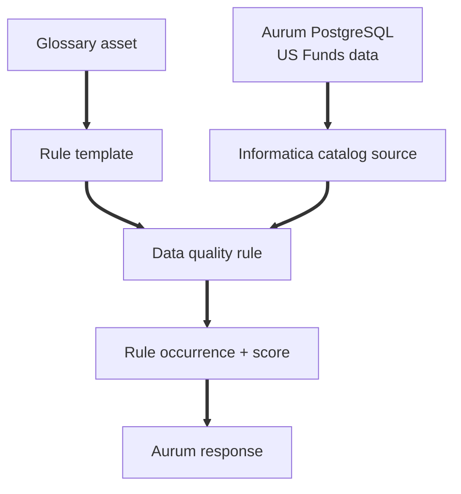
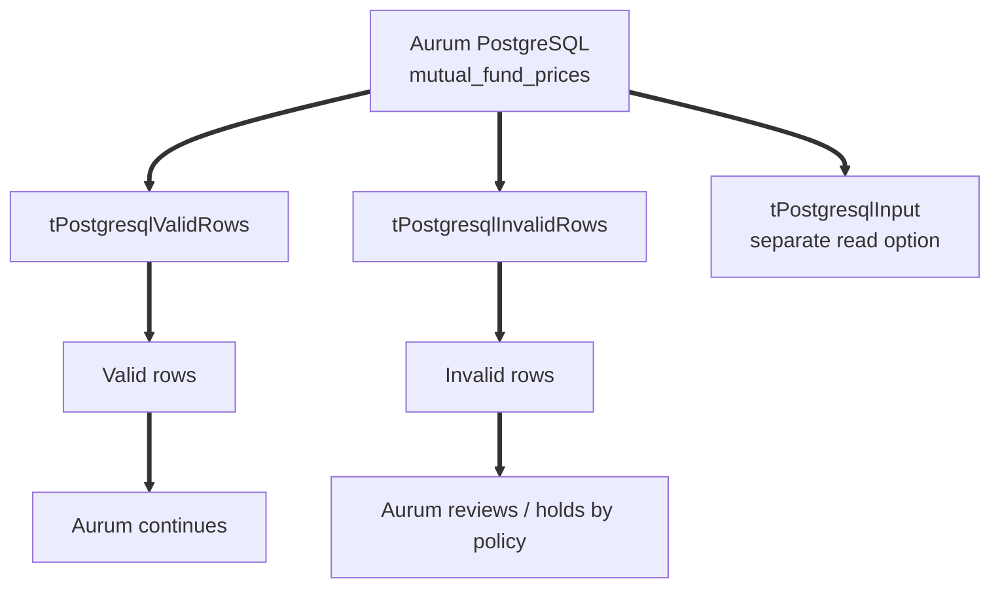
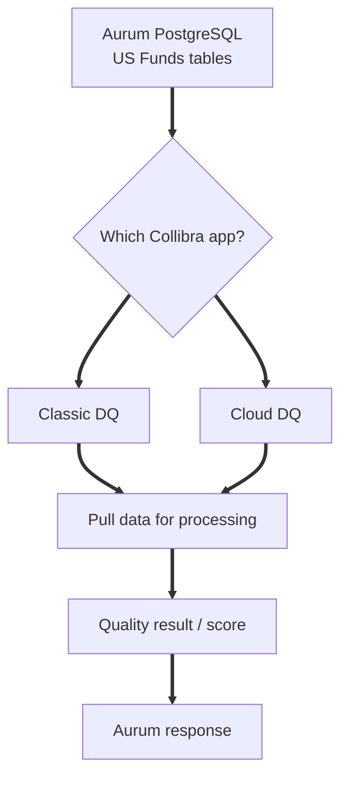
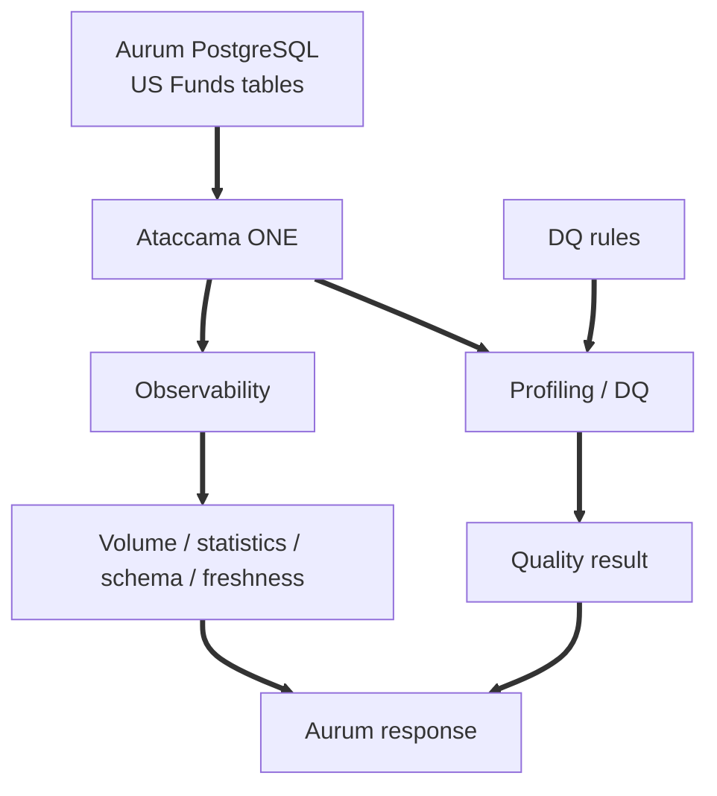

# Group 4 tools for Aurum

[Home](../README.md) · [Aurum diagrams](diagrams.md) · [Group 1 guide](group1-tools.md) · [Group 2 guide](group2-tools.md) · [Group 3 guide](group3-tools.md) · [Sources](sources.md)

## What Group 4 means

Group 4 contains **commercial enterprise data platforms**:

1. Informatica Data Quality
2. Talend Data Quality from Qlik
3. Collibra Data Quality & Observability
4. Ataccama ONE

The simple idea is:

> These tools are larger platforms. Data quality is one part of the platform, alongside capabilities such as catalog, governance, matching, master data, or observability.

For Aurum, this is a different decision from choosing a small validation library.

```text
Small validation need
Bronze to Silver checks
        ↓
Group 1 is usually simpler

Enterprise platform need
quality + governance + catalog + wider controls
        ↓
Group 4 becomes relevant
```

For the current PostgreSQL-first prototype, Group 4 is not the first POC. Soda and GX remain the first validation candidates. Group 4 makes more sense when a client already owns one of these enterprise platforms.

The product facts below come from the official links shown in each tool section and in [Group 4 sources](sources.md#group-4-sources).

## Shared Aurum example

The same US Funds dataset is used throughout:

* `mutual_funds`: 23,783 rows
* `mutual_fund_prices`: 75,657,739 rows
* `etfs`: 2,310 rows
* `etf_prices`: 3,866,030 rows

Example Aurum checks:

```text
fund_symbol is present
price_date is present
fund_symbol + price_date does not repeat
price follows the agreed rule
price symbol exists in mutual_funds
```

The examples below are teaching examples for Aurum. They are not claims that these products were installed or benchmarked in the Aurum runtime.

# 1. Informatica Data Quality

## Simple meaning

**Informatica Data Quality is part of a larger commercial Informatica platform where quality rules can be connected to governed data assets.**

In Informatica's governance and catalog flow, a rule template can be linked to a glossary asset. A rule occurrence is the result for one data element. Rule scores can be grouped into Good, Acceptable, and Not Acceptable using a target and a threshold. Rules can be scheduled daily, weekly, or monthly. The Data Quality option must be enabled in Metadata Command Center for each catalog source where these rules are used.

[Official Informatica rules documentation](https://onlinehelp.informatica.com/IICS/prod/DGC/en/cloud-data-governance-and-catalog-working-with-assets/Run_data_quality_rules_on_assets.html)

## Aurum + US Funds flow



This is a governance-oriented style. The rule sits in a wider catalog and glossary process instead of being only a SQL or YAML check.

[Official Informatica rules documentation](https://onlinehelp.informatica.com/IICS/prod/DGC/en/cloud-data-governance-and-catalog-working-with-assets/Run_data_quality_rules_on_assets.html)

## US Funds example

For `mutual_fund_prices`, imagine an Informatica rule template connected to a governed definition for fund-symbol completeness.

```text
mutual_fund_prices
        ↓
fund_symbol quality rule
        ↓
rule occurrence for the data element
        ↓
quality score
        ↓
Aurum reviews the result
```

The official page defines the rule-template, rule-occurrence, score-band, and scheduling model used in this example.

[Official Informatica rules documentation](https://onlinehelp.informatica.com/IICS/prod/DGC/en/cloud-data-governance-and-catalog-working-with-assets/Run_data_quality_rules_on_assets.html)

## PostgreSQL point for Aurum

The same Informatica rules page lists supported technical sources such as Athena, Redshift, S3, BigQuery, Cloud Storage, JDBC, ADLS Gen2, Azure SQL, Synapse, SQL Server, Oracle including RDS, SAP ERP, Salesforce, and Snowflake.

**PostgreSQL is not named on that page. JDBC is the generic entry, and the page does not say that JDBC means PostgreSQL for this feature.**

For Aurum, the safe conclusion is:

> Confirm PostgreSQL support with Informatica in a POC before designing this route.

[Official Informatica rules documentation](https://onlinehelp.informatica.com/IICS/prod/DGC/en/cloud-data-governance-and-catalog-working-with-assets/Run_data_quality_rules_on_assets.html)

## Why it could help Aurum

It can be relevant when a client already uses Informatica for governed data assets and wants data-quality rules inside that wider platform.

Informatica uses consumption-based pricing for its Intelligent Data Management Cloud platform.

[Official Informatica pricing](https://www.informatica.com/pricing)

## Main catch

For this research, the official rule page does not name PostgreSQL as a technical source. That means PostgreSQL fit must be confirmed before treating Informatica as a direct Aurum option.

It is also part of the larger Intelligent Data Management Cloud platform, so this is a broader platform choice rather than only a Bronze to Silver validator.

[Official Informatica rules documentation](https://onlinehelp.informatica.com/IICS/prod/DGC/en/cloud-data-governance-and-catalog-working-with-assets/Run_data_quality_rules_on_assets.html) · [Official Informatica pricing](https://www.informatica.com/pricing)

### Easy meeting line

> "Informatica puts data-quality rules inside a larger governance and catalog platform. Its rule page lists JDBC as a technical source, but it does not name PostgreSQL, so for Aurum we should confirm PostgreSQL support in a POC before choosing this route."

[Official references](sources.md#informatica-data-quality)

# 2. Talend Data Quality from Qlik

## Simple meaning

**Talend Data Quality is a job-design approach where data-quality steps are built into Talend Studio jobs.**

Qlik completed its acquisition of Talend in May 2023, and the Talend product documentation is now published on Qlik's help site.

[Official Qlik acquisition announcement](https://www.qlik.com/us/news/company/press-room/press-releases/qlik-acquires-talend) · [Official Talend PostgreSQL component documentation](https://help.qlik.com/talend/r/en-US/8.0/components/postgresql/postgresql-component)

## Aurum + US Funds flow



This is different from writing one SQL test or one YAML rule. The quality logic is built as part of an ETL job design.

[Official Talend PostgreSQL component documentation](https://help.qlik.com/talend/r/en-US/8.0/components/postgresql/postgresql-component)

## US Funds example

Suppose Aurum wants to check the format or rule for `fund_symbol`.

Talend Studio can read PostgreSQL data with `tPostgresqlInput` as a separate input option. For DQ splitting, `tPostgresqlValidRows` and `tPostgresqlInvalidRows` read from PostgreSQL themselves and return the rows that match or do not match the data-quality pattern.

`tPostgresqlValidRows` can check rows against regular-expression patterns or DQ rules and can use an optional WHERE clause.

[Official Talend PostgreSQL components](https://help.qlik.com/talend/r/en-US/8.0/components/postgresql/postgresql-component) · [Official tPostgresqlValidRows documentation](https://help.qlik.com/talend/en-US/components/8.0/postgresql/tpostgresqlvalidrows)

## PostgreSQL point for Aurum

The PostgreSQL components are explicitly documented for Talend Studio.

One setup detail matters: `tPostgresqlValidRows` is not shipped in Studio by default. It must be installed through the Feature Manager.

The component is listed as available in Talend Data Management Platform, Big Data Platform, Real-Time Big Data Platform, Data Services Platform, and Data Fabric.

[Official tPostgresqlValidRows documentation](https://help.qlik.com/talend/en-US/components/8.0/postgresql/tpostgresqlvalidrows)

## Other quality features to understand

Talend Cloud has a Talend Trust Score from 0 to 5 for dataset health.

[Official Talend Trust Score documentation](https://help.qlik.com/talend/en-US/data-preparation-user-guide/Cloud/talend-trust-score)

Talend also has `tMatchGroup` for grouping similar records. The component is not shipped with Talend Studio by default and is installed through the Feature Manager.

[Official tMatchGroup documentation](https://help.qlik.com/talend/en-US/components/8.0/data-matching/tmatchgroup)

## Why it could help Aurum

Talend fits when a client already builds data pipelines as Talend jobs and wants DQ to be part of those jobs.

[Official Talend PostgreSQL component documentation](https://help.qlik.com/talend/r/en-US/8.0/components/postgresql/postgresql-component)

## Main catch

For Aurum, this is a different engineering style from Soda or GX.

```text
Soda / GX
rules are the main validation object

Talend
DQ logic is built into ETL jobs and components
```

Some DQ components also need Feature Manager installation and depend on the Talend product setup.

[Official tPostgresqlValidRows documentation](https://help.qlik.com/talend/en-US/components/8.0/postgresql/tpostgresqlvalidrows) · [Official tMatchGroup documentation](https://help.qlik.com/talend/en-US/components/8.0/data-matching/tmatchgroup)

### Easy meeting line

> "Talend is more of a job-design approach. We can read PostgreSQL data and build quality steps into the ETL job, including splitting valid and invalid rows. That is useful if a client already uses Talend, but it is heavier than adding a small SQL or YAML validation layer to Aurum."

[Official references](sources.md#talend-data-quality-from-qlik)

# 3. Collibra Data Quality & Observability

## Simple meaning

**Collibra Data Quality & Observability is an enterprise data-quality platform with separate Classic and Cloud documentation.**

This distinction matters because the PostgreSQL connection model is not described the same way in both apps.

[Classic PostgreSQL documentation](https://productresources.collibra.com/docs/collibra/latest/Content/DataQuality/DBConnection/ref_postgresql.htm) · [Cloud supported data sources](https://productresources.collibra.com/docs/collibra/2026.08/Content/UnifiedDataQuality/DataSources/ref_data-quality-supported-data-sources.htm)

## Aurum + US Funds flow



The first design question is not only "Can Collibra connect to PostgreSQL?" It is also "Are we talking about Classic or Cloud?"

[Classic PostgreSQL documentation](https://productresources.collibra.com/docs/collibra/latest/Content/DataQuality/DBConnection/ref_postgresql.htm) · [Cloud supported data sources](https://productresources.collibra.com/docs/collibra/2026.08/Content/UnifiedDataQuality/DataSources/ref_data-quality-supported-data-sources.htm)

## US Funds example

For `mutual_fund_prices`, Collibra can calculate a quality score for the monitored data.

The documented score bands are:

```text
90 to 100 = pass
76 to 89  = warning
0 to 75   = fail
```

Aurum could read that result as evidence, but Aurum would still decide what pass, warning, or fail means for its own release policy.

[Official Collibra quality score documentation](https://productresources.collibra.com/docs/collibra/latest/Content/UnifiedDataQuality/co_about-data-quality-scores.htm)

## PostgreSQL point for Aurum

### Classic

The Classic PostgreSQL page lists:

* driver class `org.postgresql.Driver`
* default port `5432`
* PostgreSQL driver version `42.5.1`
* read access on the tables
* the `ROLE_ADMIN` role in Collibra DQ
* pushdown set to `No`
* processing through the Spark agent, Yarn agent, or Parallel JDBC
* JDK 8 and 11

[Classic PostgreSQL documentation](https://productresources.collibra.com/docs/collibra/latest/Content/DataQuality/DBConnection/ref_postgresql.htm)

### Cloud

The Cloud supported-sources page lists PostgreSQL as a JDBC source with processing mode **Pullup** and driver version `25.0.9543`. No pushdown is shown for PostgreSQL on that page.

[Cloud supported data sources](https://productresources.collibra.com/docs/collibra/2026.08/Content/UnifiedDataQuality/DataSources/ref_data-quality-supported-data-sources.htm)

### Version caution

The compatibility page shows that PostgreSQL driver versions can differ by Collibra Platform release.

For Aurum, pin the Collibra release before writing connection requirements.

[Official Collibra compatibility documentation](https://productresources.collibra.com/docs/collibra/2026.08/Content/UnifiedDataQuality/ref_dq-compatibilities.htm)

## Why it could help Aurum

Collibra becomes relevant when a client already uses Collibra and wants data quality in the same enterprise environment.

The quality score also gives a simple pass, warning, and fail view that can be mapped into Aurum policy after the integration is defined.

[Official Collibra quality score documentation](https://productresources.collibra.com/docs/collibra/latest/Content/UnifiedDataQuality/co_about-data-quality-scores.htm)

## Main catch

Classic and Cloud are different apps with separate documentation. We must name the app and release before designing the PostgreSQL integration.

PostgreSQL is not documented as pushdown in the pages used here. Classic says pushdown `No`, and Cloud lists PostgreSQL as `Pullup`.

[Classic PostgreSQL documentation](https://productresources.collibra.com/docs/collibra/latest/Content/DataQuality/DBConnection/ref_postgresql.htm) · [Cloud supported data sources](https://productresources.collibra.com/docs/collibra/2026.08/Content/UnifiedDataQuality/DataSources/ref_data-quality-supported-data-sources.htm)

### Easy meeting line

> "Collibra can work with PostgreSQL, but we must first say whether we mean Classic or Cloud. Classic uses pull-style processing with no PostgreSQL pushdown, and Cloud lists PostgreSQL as Pullup. We should also pin the Collibra release because the documented PostgreSQL driver version changes by release."

[Official references](sources.md#collibra-data-quality-and-observability)

# 4. Ataccama ONE

## Simple meaning

**Ataccama ONE combines data processing, data quality, catalog-style controls, and data observability in one enterprise platform.**

PostgreSQL is listed as a supported connector using username and password authentication.

[Official Ataccama supported connectors](https://docs.ataccama.com/ataccama-one-agentic/latest/data-processing/supported-connectors.html)

## Aurum + US Funds flow



This gives Aurum both rule-based quality results and observability signals from one platform.

[Official Ataccama data observability documentation](https://docs.ataccama.com/one/latest/data-observability/data-observability.html) · [Official Ataccama data-quality overview](https://docs.ataccama.com/one/latest/data-quality/data-quality-overview.html)

## US Funds example

For `mutual_fund_prices`, Ataccama can monitor:

```text
data-quality results
volume anomalies
statistical anomalies
schema changes
freshness
```

Before configuring observability, Ataccama requires at least sample profiling on the source.

[Official Ataccama data observability documentation](https://docs.ataccama.com/one/latest/data-observability/data-observability.html)

## PostgreSQL point for Aurum

The supported-connectors page lists PostgreSQL as supported for:

* catalog and data processing
* Edge processing

It does **not** list lineage support for PostgreSQL.

Pushdown processing is listed only for Snowflake and Databricks on that page, so we should not claim PostgreSQL pushdown.

[Official Ataccama supported connectors](https://docs.ataccama.com/ataccama-one-agentic/latest/data-processing/supported-connectors.html)

## Freshness setup

Freshness works by default for PostgreSQL in Ataccama observability, but PostgreSQL needs:

```text
track_commit_timestamp = on
```

in `postgresql.conf`.

Changing this setting requires a PostgreSQL restart.

[Official Ataccama data observability documentation](https://docs.ataccama.com/one/latest/data-observability/data-observability.html)

## Rules and glossary

Ataccama DQ rules can be mapped through glossary terms, and rules can also be mapped directly to attributes.

That means a glossary is useful for larger governance setups, but it is not mandatory for every DQ evaluation flow.

[Official Ataccama DQ evaluation documentation](https://docs.ataccama.com/one/latest/data-quality/run-dq-evaluation.html) · [Official Ataccama rule documentation](https://docs.ataccama.com/one/latest/data-quality/rules.html)

## Why it could help Aurum

Ataccama is relevant when a client wants data-quality checks and observability in one enterprise platform and already uses Ataccama.

[Official Ataccama data observability documentation](https://docs.ataccama.com/one/latest/data-observability/data-observability.html)

## Main catch

For PostgreSQL:

* lineage is not supported on the connector table used for this research
* pushdown is not listed for PostgreSQL
* freshness needs the PostgreSQL configuration change described above
* observability setup needs at least sample profiling first

[Official Ataccama supported connectors](https://docs.ataccama.com/ataccama-one-agentic/latest/data-processing/supported-connectors.html) · [Official Ataccama data observability documentation](https://docs.ataccama.com/one/latest/data-observability/data-observability.html)

### Easy meeting line

> "Ataccama ONE supports PostgreSQL for catalog, data processing, and Edge processing, and it can monitor DQ results, anomalies, schema changes, and freshness. But PostgreSQL lineage is not supported in the connector table, pushdown is not listed for Postgres, and freshness needs track_commit_timestamp enabled."

[Official references](sources.md#ataccama-one)

# Simple comparison

<table>
<thead>
<tr><th>Tool</th><th>Simple meaning</th><th>PostgreSQL point for Aurum</th><th>Main caution</th><th>Sources</th></tr>
</thead>
<tbody>
<tr><td>Informatica Data Quality</td><td>DQ rules inside a larger governance and catalog platform</td><td>PostgreSQL is not named on the rule page; JDBC is generic</td><td>Confirm PostgreSQL support in a POC</td><td><a href="sources.md#informatica-data-quality">Sources</a></td></tr>
<tr><td>Talend Data Quality from Qlik</td><td>Build DQ into Talend Studio ETL jobs</td><td>PostgreSQL components are explicitly documented</td><td>Some DQ components need Feature Manager installation</td><td><a href="sources.md#talend-data-quality-from-qlik">Sources</a></td></tr>
<tr><td>Collibra Data Quality &amp; Observability</td><td>Enterprise DQ with Classic and Cloud variants</td><td>PostgreSQL is documented, but processing is not pushdown in the cited pages</td><td>Name Classic or Cloud and pin the release</td><td><a href="sources.md#collibra-data-quality-and-observability">Sources</a></td></tr>
<tr><td>Ataccama ONE</td><td>DQ plus observability and wider data controls</td><td>PostgreSQL supports catalog, data processing, and Edge processing</td><td>No PostgreSQL lineage on the connector table; no PostgreSQL pushdown claim</td><td><a href="sources.md#ataccama-one">Sources</a></td></tr>
</tbody>
</table>

# Does Aurum need Group 4 now?

For the current PostgreSQL-first Aurum prototype, **Group 4 is not the first POC**.

The immediate Aurum requirement is still:

```text
PostgreSQL Bronze
      ↓
known DQ checks
      ↓
PASS / FAIL
      ↓
Aurum policy
```

Soda and GX remain the first validation candidates because the current need is focused validation, not adoption of a larger enterprise platform.

Group 4 fits better when a client already owns Informatica, Talend, Collibra, or Ataccama and wants Aurum to work with that existing platform.

This is an Aurum architecture assessment based on the product capabilities documented in the [Group 4 source list](sources.md#group-4-sources).

# If we run a Group 4 POC

Use the same US Funds dataset and the same Aurum test pattern.

## Test A: clean load

```text
valid symbols
valid dates
no duplicate fund + date key
valid price values
```

Expected Aurum interpretation:

```text
PASS
```

## Test B: bad load

Prepare examples such as:

```text
missing fund_symbol
duplicate fund_symbol + price_date
invalid price
orphan symbol
```

Expected Aurum interpretation:

```text
FAIL
```

## Test C: tool failure

Simulate:

```text
connection unavailable
permissions missing
quality job cannot run
```

Aurum must record:

```text
CHECK DID NOT RUN
```

It must not convert an execution failure into PASS.

## Compare

* PostgreSQL connection setup
* rule coverage
* failed-row evidence
* source-database processing model
* runtime on a representative US Funds load
* Aurum API or result integration
* operational setup
* licensing or consumption model
* whether the client already owns the platform

This POC checklist is an Aurum evaluation plan, not a vendor capability claim.

# Group 4 conclusion for Aurum

All four Group 4 tools are commercial enterprise platforms. They overlap with wider areas such as catalog, governance, observability, matching, or master-data style capabilities, depending on the product.

For the PostgreSQL-first prototype, they are **not the first POC**.

```text
First validation POC:
Soda vs GX

Enterprise-client scenario:
evaluate the platform the client already owns
```

The main Group 4 value is integration with an existing enterprise data platform, not replacing a focused Bronze to Silver validator by default.

The product-specific parts of this conclusion are grounded in the [Group 4 official source list](sources.md#group-4-sources).

# Meeting-ready explanation

> "Group 4 contains large commercial enterprise platforms: Informatica, Talend, Collibra, and Ataccama. They do data quality, but they are broader than a small DQ library. They are more relevant when a client already uses that platform for governance, catalog, ETL, or observability. For our PostgreSQL-first Aurum prototype, I would still test Soda and GX first. If a client already owns one of these Group 4 platforms, then the right question is how Aurum can integrate with it rather than adding another quality stack."

[Group 4 official sources](sources.md#group-4-sources)
